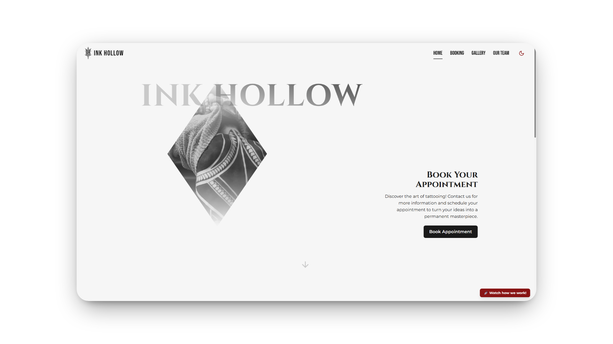
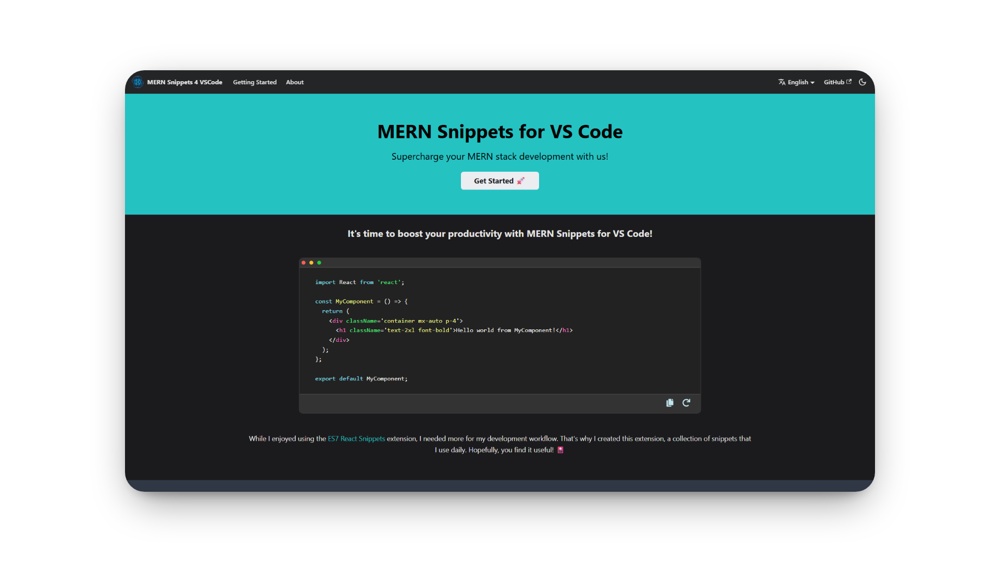
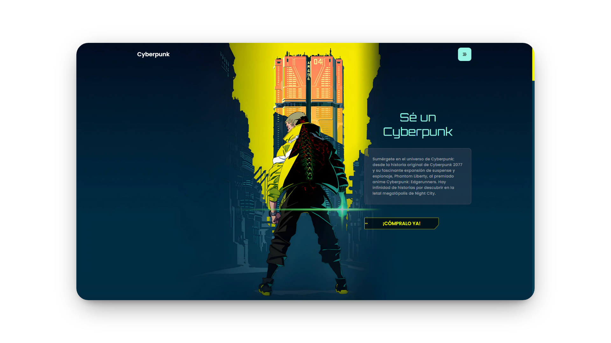

[⚠️ Suspicious Content] 

# 💫 About Me:

👋 Hi, I'm **Adan** — a passionate Junior Developer who loves building creative solutions and learning new technologies every day.  
Currently focused on both Frontend and Backend development.  
💬 Always open to discuss new ideas and collaborations!

## 🚀 Latest Projects

<table>
  <tr>
    <td align="center" valign="top">
      <a href="https://ink-hollow.vercel.app/">
         
        <b>Ink Hollow</b>
      </a>
       
      
        <b>Tech Stack:</b> React, TypeScript, Tailwind CSS, Node.js, Express, Firebase Firestore, Cloudinary 
        <b>Features:</b> 
        - Clean and minimal tattoo studio website 
        - Browse tattoo designs & company photos 
        - Contact & booking system with database 
        - AI-powered tattoo design inspiration 
        - Cloudinary image storage 
        - Email confirmations (user & studio) & PDF appointment with QR code 
        - Dark mode
      
    </td>
    <td align="center" valign="top">
      <a href="https://mern-snippets-4-vscode.netlify.app/">
         
        <b>MERN Snippets 4 VSCode</b>
      </a>
       
      
        <b>Tech Stack:</b> JavaScript, React, Node.js, VSCode Extension API, Tailwind CSS 
        <b>Features:</b> 
        - VSCode extension for MERN stack projects 
        - Generate boilerplate & components via commands 
        - Snippets for MongoDB, Express, React, Node.js 
        - Mongoose connection & React component helpers 
        - Tailwind CSS support 
        - Easy access via command palette 
        - Full documentation & previews
      
    </td>
    <td align="center" valign="top">
      <a href="https://adanperez-cyberpunk-website-react.netlify.app/">
         
        <b>Cyberpunk Website</b>
      </a>
       
      
        <b>Tech Stack:</b> React, Tailwind CSS, Framer Motion 
        <b>Features:</b> 
        - Landing page inspired by cyberpunk, anime, and games 
        - Neon colors, animated transitions, and futuristic UI 
        - Simple, responsive, and visually bold
      
    </td>
  </tr>
</table>

## 🌐 Connect with me

---

## 💻 Tech Stack

---

## 📊 Explore My Projects

---

## 📚 Currently Learning & Design Tools

---

### ✨ Thanks!

## GitHub Stats:

<!-- Proudly created with GPRM ( https://gprm.itsvg.in ) -->
